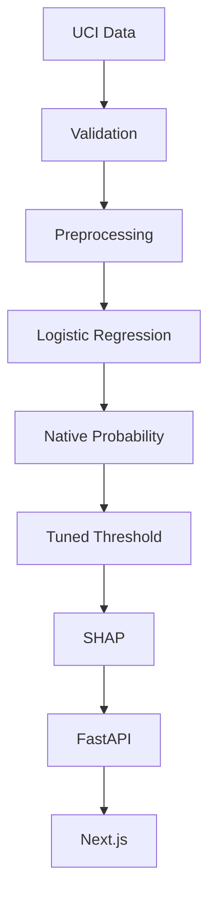

# CardioRisk AI

An Explainable Heart Disease Risk Prediction System designed as a professional machine learning decision-support demonstration.

## Live Demo
[Not currently deployed externally]

## Problem
Heart disease prediction from structured clinical data requires both accurate classification and interpretable decision-making. This project demonstrates how to build a robust machine learning pipeline that handles class imbalance, optimizes decision thresholds to minimize costly false negatives, and provides patient-level explainability without replacing clinical judgment.

## Key Engineering Features
- Leakage-safe preprocessing
- Reproducible evaluation
- Imbalance strategy comparison
- Model benchmarking
- Calibration audit
- Threshold optimization
- SHAP explainability
- FastAPI backend
- Next.js frontend
- Automated tests
- Dockerized local environment
- GitHub Actions CI

## Architecture


## Dataset
- **Source**: UCI Cleveland Heart Disease dataset (historical from 1988).
- **Size**: 303 observations.
- **Predictors**: 13 features (age, sex, chest pain type, resting BP, etc.).
- **Target Transformation**: The original 0-4 target was converted to a binary target (0: Absence, 1: Presence).
- **Missing Values**: Handled explicitly via imputation during preprocessing.

## Modeling Methodology
- **Split**: 80/20 stratified split into development (242 samples) and held-out test (61 samples) sets.
- **Evaluation**: Development used 5-fold Repeated Stratified CV.
- **Class-Weight Comparison**: Class-weighting proved superior to SMOTE in balancing Recall and F1.
- **Model Benchmarking**: Logistic Regression outperformed Random Forest and Gradient Boosting.
- **Calibration Audit**: Retained native Logistic Regression probabilities (Brier score 0.119) over Sigmoid calibration (0.123).
- **Threshold Optimization**: A decision threshold of 0.42 was optimized strictly on the development set to enforce a recall-first policy.
- **Final Evaluation**: Conducted exactly once on the locked 61-sample test set.

## Results
**Cross-Validation Metrics (Development Set)**:
- Recall: 0.865
- F1 Score: 0.835

**Final Locked Held-Out Test Metrics**:
- Accuracy: 0.885
- Recall: 0.964
- Specificity: 0.818
- F1 Score: 0.885
- ROC-AUC: 0.957

## Calibration Decision
- Native Logistic Regression Brier score: `0.119`
- Sigmoid calibration Brier score: `0.123`
- *Decision*: Native probabilities were retained, as calibration worsened the Brier score due to the small dataset size causing minor overfitting.

## Explainability
- **Global SHAP**: Identifies general dataset trends.
- **Local SHAP**: Explains individual predictions by breaking down risk-increasing and decreasing factors.
- **Limitations**: SHAP provides statistical feature attribution, which does not equate to biological causality.

## API
- `GET /health` : Returns system health and artifact load status.
- `GET /model-info` : Exposes model metadata (version, feature count, threshold).
- `POST /predict` : Validates canonical inputs and returns probability, SHAP values, and classification.

**Request Example**:
```json
{
  "age": 63,
  "sex": "Male",
  "chest_pain_type": "Typical Angina",
  "resting_bp": 145,
  "cholesterol": 233,
  "fasting_blood_sugar": "Yes",
  "resting_ecg": "Left Ventricular Hypertrophy",
  "max_heart_rate": 150,
  "exercise_induced_angina": "No",
  "st_depression": 2.3,
  "st_slope": "Downsloping",
  "num_major_vessels": 0,
  "thalassemia": "Fixed Defect"
}
```

## Frontend
Pages implemented:
- **Overview** (`/`)
- **Risk Assessment** (`/assessment`)
- **Performance** (`/performance`)
- **Explainability** (`/explainability`)
- **Model Card** (`/model-card`)

## Run Locally with Docker
Instructions for Windows / Docker Desktop:
1. Install Docker Desktop.
2. Clone repository.
3. Ensure `frontend/.env` is created (use `frontend/.env.example`).
4. Run:
   ```bash
   docker compose up --build
   ```
5. Open:
   - Frontend: http://localhost:3000
   - Backend: http://localhost:8000
   - API Docs: http://localhost:8000/docs
   - Health: http://localhost:8000/health
6. Stop:
   ```bash
   docker compose down
   ```

## Run Without Docker
**Backend**:
```bash
pip install -r requirements.txt
uvicorn src.api.main:app --host 0.0.0.0 --port 8000
```
**Frontend**:
```bash
cd frontend
npm ci
npm run dev
```

## Testing
```bash
# Python tests
pytest tests/

# Integration tests
python scripts/integration_test.py
```

## Repository Structure
```
cardiorisk-ai/
├── artifacts/      # Locked models, metrics, plots
├── data/           # Raw and processed datasets
├── docs/           # Deployment guides
├── frontend/       # Next.js React application
├── notebooks/      # Exploratory Data Analysis
├── reports/        # Methodology, experiments, subgroup analysis
├── scripts/        # Training and utility scripts
├── src/            # Core ML pipelines and FastAPI routes
└── tests/          # Pytest suite
```

## Reports
Detailed documentation is stored centrally in the `reports/` folder:
- [Methodology Audit](reports/sprint2_methodology_audit.md)
- [Experiment Report](reports/experiment_report.md)
- [Model Card](reports/model_card.md)
- [Subgroup Analysis](reports/subgroup_analysis.md)
- [Limitations](reports/limitations.md)

## Limitations
Small historical dataset (1988), limited representativeness, small subgroup counts, no external validation. Model probability is a statistical estimation, not a diagnostic certainty.

## Disclaimer
**Educational Purpose Only**: This application is an educational machine learning decision-support demonstration. It must never claim to diagnose disease, recommend treatment, or replace a qualified healthcare professional.
